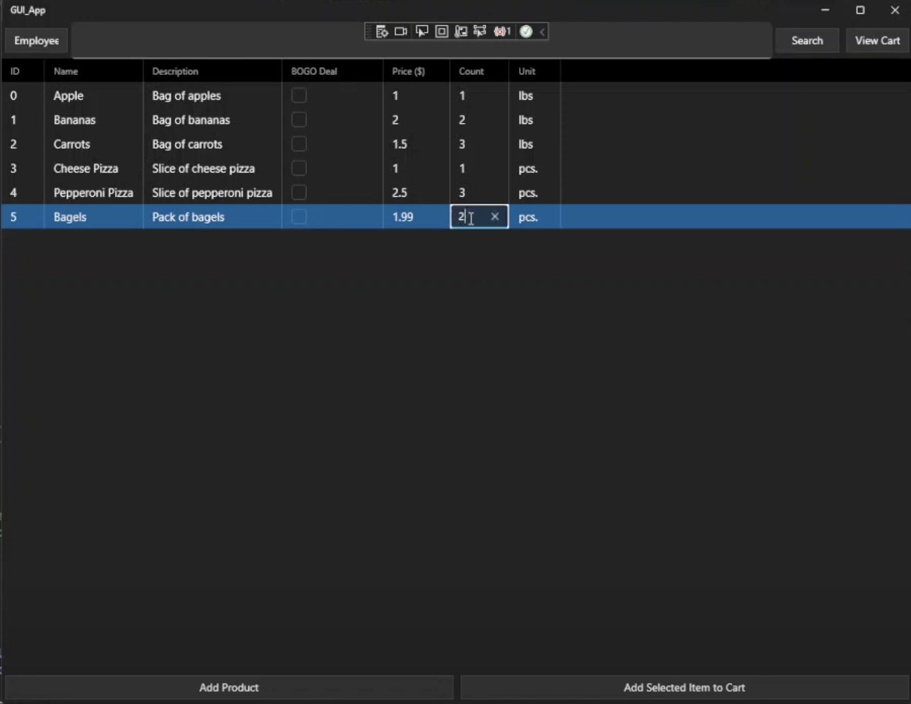
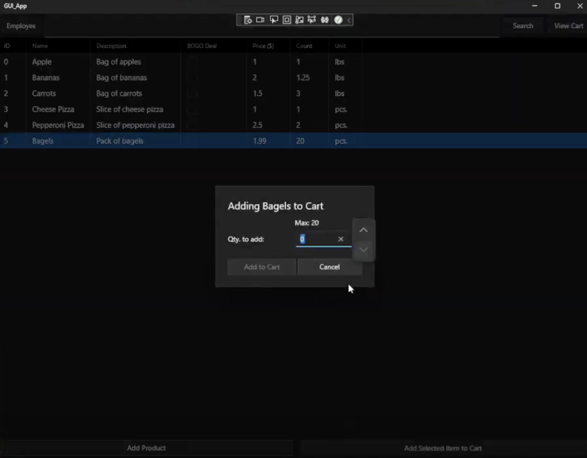
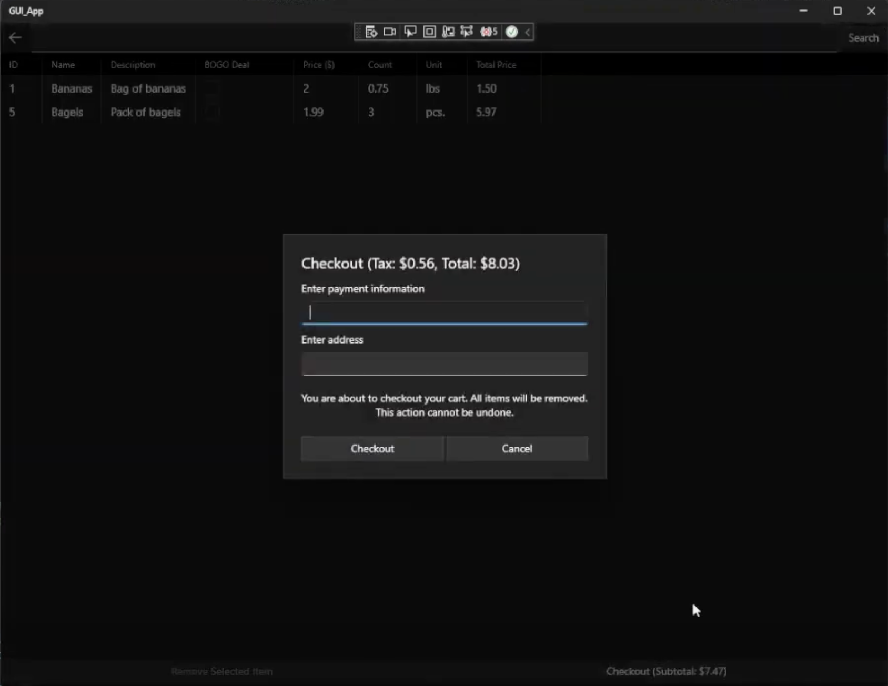
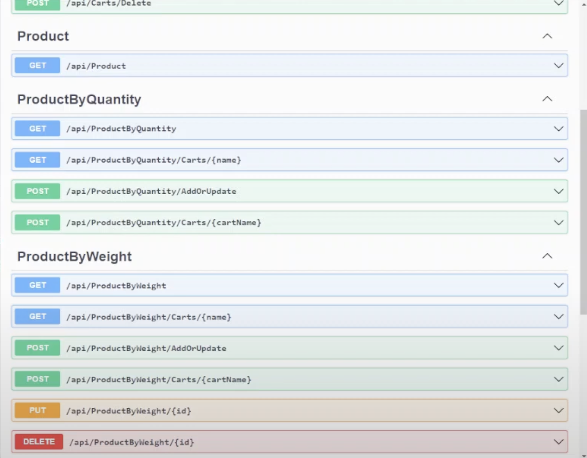

# C-Sharp-Ecommerce-App

This is my project that I built for the CIS4930 - C# class.
It was written with C# and XAML for the UI. It was developed
using Visual Studio 2019.

The project was built in stages with each stage having its own branch.

It has not been updated since the project was submitted in the Summer of
2022 so it may not work out-of-the-box.

## Screenshots

I used [DataGrid](https://learn.microsoft.com/en-us/windows/communitytoolkit/controls/datagrid) for the main UI for viewing products and viewing your cart.

I used [NumberBox](https://learn.microsoft.com/en-us/windows/apps/design/controls/number-box) with `SpinButtonPlacementMode` set to `Compact`.

Checkout process.

Backend was exposed as an API using [Swagger UI](https://learn.microsoft.com/en-us/aspnet/core/tutorials/web-api-help-pages-using-swagger?view=aspnetcore-7.0)
